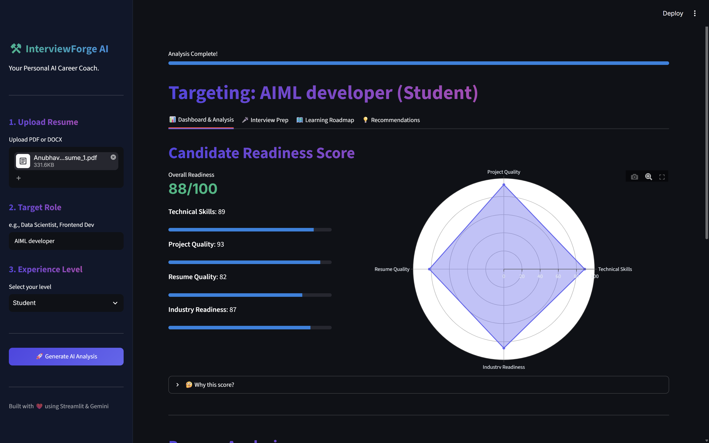
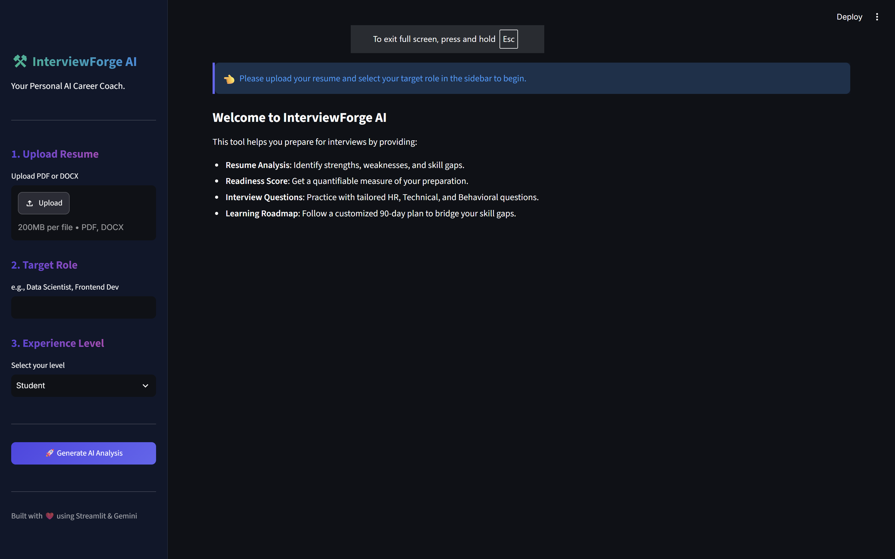
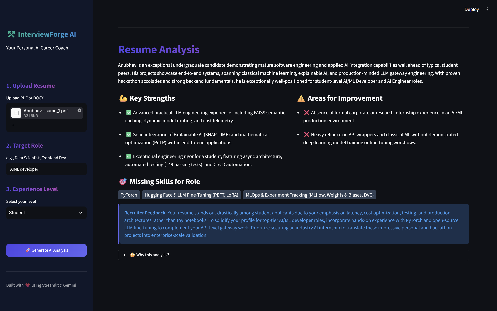
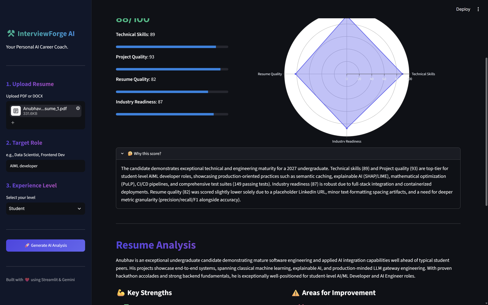
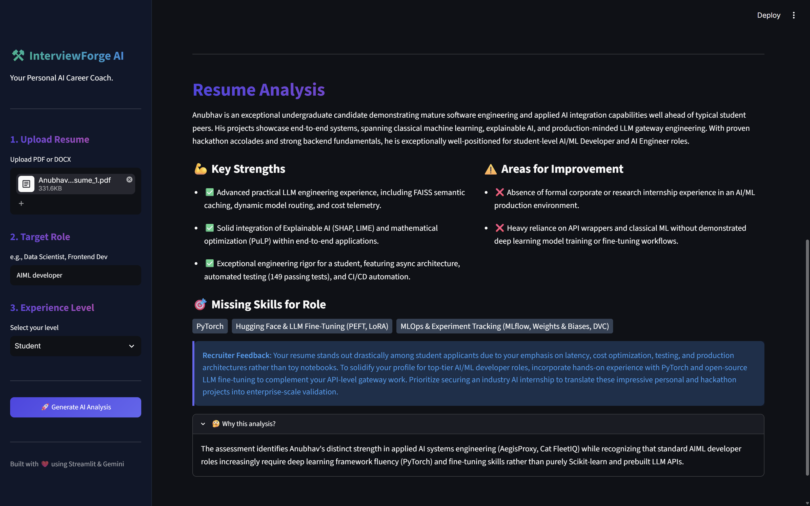
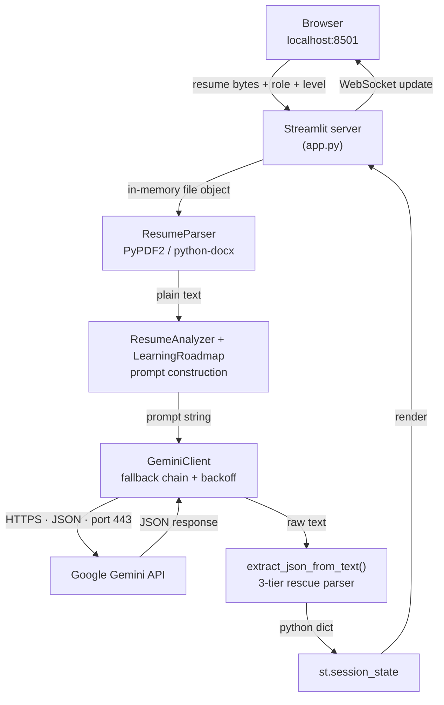

<div align="center">

# ⚒️ InterviewForge AI

### Your personal AI career coach — turn any resume into a scored, explained, and actionable interview prep plan.

[](https://www.python.org/)
[](https://streamlit.io/)
[](https://ai.google.dev/)
[](https://plotly.com/python/)

**Upload a resume → pick a target role → get a readiness score, a recruiter-grade critique, 40 tailored interview questions, and a 90-day upskilling roadmap.**
Every single output ships with a *"Why?"* explanation.



</div>

---

## 📖 Table of Contents

- [What it does](#-what-it-does)
- [Screenshots](#-screenshots)
- [How it works](#-how-it-works)
- [The AI pipeline](#-the-ai-pipeline)
- [Tech stack](#-tech-stack)
- [Project structure](#-project-structure)
- [Quickstart](#-quickstart)
- [Configuration](#-configuration)
- [Known limitations](#-known-limitations)
- [Roadmap](#-roadmap)

---

## ✨ What it does

| | Feature | What you get |
|:---:|:---|:---|
| 📄 | **Resume parsing** | Extracts clean text from PDF and DOCX resumes entirely in memory — nothing is ever written to disk. |
| 📊 | **Readiness score** | Five scores (0–100) across Technical Skills, Project Quality, Resume Quality, Industry Readiness and an overall figure, plotted on an interactive Plotly radar chart. |
| 🔍 | **Recruiter-grade analysis** | Strengths, weaknesses, skill gaps and a direct paragraph of feedback written from a recruiter's perspective. |
| 🎤 | **40 tailored questions** | 10 each of HR, Technical, Behavioral and Project-Based questions, generated from *your* resume — not a generic list. |
| 🗺️ | **90-day roadmap** | A 30/60/90 plan built specifically around the skill gaps found in step one. |
| 💡 | **Actionable recommendations** | Resume rewrites, project ideas, certifications and portfolio improvements. |
| 🧐 | **Explainable by default** | Every section has a *"🤔 Why this?"* expander containing the model's own reasoning. No black boxes. |
| 🛡️ | **Resilient model chain** | Automatically falls back across four Gemini models with exponential backoff when Google's API is overloaded. |

---

## 📸 Screenshots

### Landing — three inputs, one button



The entire input surface is three fields in the sidebar: a drag-and-drop uploader capped at 200 MB, a target role, and an experience level ranging from *Student* to *Senior*.

<br>

### After upload — the readiness dashboard


Once the analysis finishes, the app switches into a four-tab dashboard. The overall score sits beside per-category bars and a radar chart with a fixed 0–100 axis, so a weak score always *looks* weak.

<br>

### Resume analysis — strengths, gaps, and a recruiter's verdict



Strengths and weaknesses sit side by side, missing skills render as tags, and the recruiter feedback panel gives the blunt version — here, flagging heavy reliance on API wrappers over demonstrated deep-learning work.

<br>

### Explainable AI — every score is defended

<table>
<tr>
<td width="50%"></td>
<td width="50%"></td>
</tr>
<tr>
<td align="center"><em>“Why this score?” — a per-category justification</em></td>
<td align="center"><em>“Why this analysis?” — the logic behind the gaps</em></td>
</tr>
</table>

Every AI prompt in this project explicitly requests a `reasoning` field. That field is what powers these expanders — the app never shows you a number it can't explain.

---

## 🔧 How it works



There is no separate frontend and backend. Streamlit runs a single Python process that serves the UI **and** executes the logic, listening on **port 8501**. The only outbound traffic is the HTTPS call to Google's Gemini API.

> **Note on Streamlit's execution model:** the entire script re-runs top to bottom on every interaction. That's why results are cached in `st.session_state` — without it, switching tabs would wipe your analysis and trigger four fresh API calls.

---

## 🤖 The AI pipeline

One button press fires **four sequential Gemini calls**:

| # | Call | Input | Output keys |
|:---:|:---|:---|:---|
| 1 | `analyze_resume()` | resume text + role + level | `summary`, `strengths`, `weaknesses`, `missing_skills`, `recruiter_feedback`, `reasoning` |
| 2 | `generate_readiness_score()` | resume text + role + level | `scores{…}`, `suggestions{…}`, `reasoning` |
| 3 | `generate_interview_questions()` | resume text + role + level | 4 × 10 questions, `reasoning` |
| 4 | `generate_roadmap()` | **the skill gaps from call 1** | `day_30`, `day_60`, `day_90`, `reasoning` |

Call 4 deliberately consumes call 1's output, so the roadmap targets exactly the gaps that were found.

### Getting reliable JSON out of an LLM

Three mechanisms stack on top of each other:

1. **Schema-by-example** — each prompt contains a literal drawing of the JSON structure it wants back.
2. **Google's JSON mode** — `response_mime_type="application/json"` constrains generation server-side, so output is guaranteed to *parse*.
3. **A 3-tier rescue parser** (`utils/helpers.py`) — strict `json.loads()`, then markdown code-fence extraction, then a greedy `{...}` grab. Whatever the model wraps its answer in, the dictionary gets recovered.

### Surviving an overloaded API

```python
MODEL_CHAIN = [
    "gemini-3.7-flash",       # tried first
    "gemini-3.6-flash",       # fallback on repeated 503 / 429
    "gemini-3.5-flash",
    "gemini-3.5-flash-lite",  # last resort
]
```

Errors are classified as **transient** (`503`, `429`, `500`, `overloaded`, `quota`, `capacity`…) or **permanent**. Transient failures get two retries per model with exponential backoff (5s, 10s) before dropping to the next model; permanent failures raise immediately instead of wasting 45 seconds retrying a bad API key. A 3-second minimum spacing between calls keeps free-tier rate limits happy.

---

## 🛠 Tech stack

| Layer | Choice | Why |
|:---|:---|:---|
| **UI + server** | Streamlit | One Python file becomes a full interactive dashboard — no HTML, JS or separate backend needed. |
| **AI** | Google Gemini (Flash tier) | Fast, cheap, generous free tier, and native JSON-mode support. |
| **PDF parsing** | PyPDF2 | Pure Python, no system dependencies. |
| **DOCX parsing** | python-docx | Reads Word documents paragraph by paragraph. |
| **Charts** | Plotly | Interactive radar chart with hover, zoom and PNG export. |
| **Config** | python-dotenv | Keeps the API key out of the source code and out of Git. |
| **Styling** | Custom CSS | Gradient headings, styled tabs, and a dark dashboard aesthetic. |

---

## 📁 Project structure

```
AI resume analyzer/
├── app.py                      # Entire UI: sidebar, 4 tabs, charts, alerts
├── requirements.txt            # Dependencies
├── .env                        # Your GEMINI_API_KEY (git-ignored)
├── .env.example                # Template showing what .env needs
├── assets/
│   └── style.css               # Gradient headings, buttons, tabs, alerts
├── services/
│   ├── resume_parser.py        # PDF & DOCX → plain text
│   ├── gemini_service.py       # API client, model fallback, retries, spacing
│   ├── analyzer.py             # 3 prompts: analysis, questions, scoring
│   └── roadmap.py              # 1 prompt: the 30/60/90-day plan
├── utils/
│   └── helpers.py              # 3-tier JSON rescue parser
└── docs/
    └── screenshots/            # Images used in this README
```

---

## 🚀 Quickstart

### 1. Clone and enter the project

```bash
git clone <repository-url>
cd "AI resume analyzer"
```

### 2. Create a virtual environment (recommended)

```bash
python -m venv venv
venv\Scripts\activate        # Windows
source venv/bin/activate     # macOS / Linux
```

### 3. Install dependencies

```bash
pip install -r requirements.txt
```

### 4. Add your Gemini API key

Grab a free key from [Google AI Studio](https://aistudio.google.com/app/apikey), then copy the template:

```bash
copy .env.example .env       # Windows
cp .env.example .env         # macOS / Linux
```

Open `.env` and set:

```env
GEMINI_API_KEY=your_actual_key_here
```

### 5. Run it

```bash
streamlit run app.py
```

The app opens at **http://localhost:8501**. Upload a resume, type a target role, click **🚀 Generate AI Analysis**, and wait roughly 20–50 seconds for all four AI calls to complete.

---

## ⚙️ Configuration

| Setting | Where | Default | Notes |
|:---|:---|:---|:---|
| API key | `.env` | — | Required. Never commit this file. |
| Model preference | `services/gemini_service.py` → `MODEL_CHAIN` | 4 Gemini Flash models | Reorder or extend freely. |
| Call spacing | `services/gemini_service.py` → `CALL_SPACING` | `3` seconds | Lower it for speed on a paid key; raise it if you hit 429s. |
| Retries per model | `services/gemini_service.py` → `max_retries_per_model` | `2` | Two attempts before falling through to the next model. |
| Accepted file types | `app.py` line 52 **and** `services/resume_parser.py` | `pdf`, `docx` | Both must be updated together to add a format. |
| Server port | CLI flag | `8501` | `streamlit run app.py --server.port 8600` |
| Max upload size | `.streamlit/config.toml` | 200 MB | Create the file with `[server]` → `maxUploadSize` to change. |

---

## ⚠️ Known limitations

Being upfront about what this does *not* do:

- **Scanned or image-based PDFs won't work.** There is no OCR — a PDF must contain a real text layer, or you'll get *"PDF appears to be empty."*
- **DOCX tables are skipped.** Only `doc.paragraphs` is read, so skills or contact details placed inside a table are invisible to the parser.
- **Scores are structured opinion, not measurement.** They come from a language model, not a rubric. The same resume can score 82 one run and 88 the next — the `reasoning` field is the genuinely useful output.
- **Nothing is persisted.** Refresh the browser and the analysis is gone. There is no database and no history.
- **No authentication.** Anyone who can reach the URL spends your API quota, so keep this on `localhost` unless you add auth first.
- **Resume text is sent to Google.** Fine for personal use; worth stating plainly before anyone else uses it.
- **Calls run sequentially.** Three of the four are independent and could run in parallel for a ~3× speedup, at the cost of a higher rate-limit risk.

---

## 🗺 Roadmap

- [ ] Parallelise the three independent Gemini calls to cut runtime from ~40s to ~15s
- [ ] Read DOCX tables so template-based resumes don't lose content
- [ ] Surface a visible warning when an AI reply can't be parsed, instead of rendering a blank section
- [ ] Cache results by resume + role hash so repeat runs are instant and free
- [ ] Export the roadmap and analysis as a downloadable PDF
- [ ] Integrate the GitHub API to review a candidate's actual code
- [ ] Mock interview mode with recorded answers and AI feedback
- [ ] Add unit tests for the parser and the JSON rescue logic

---

<div align="center">

**Built with ❤️ using Streamlit &amp; Google Gemini**

<sub>Run it locally · Bring your own API key · No data stored</sub>

</div>
